# Mars Rovers 🚀
This app was developed by Can Bi. It uses SwiftUI and is written 100% in Swift. The project benefits from multi-threading, publishers/subscribers, and data persistance.

### NASA API
The app uses [NASA Open APIs](https://api.nasa.gov/index.html#browseAPI) and shows Mars photos taken by Curiosity, Opportunity and Spirit rovers. 

### Implemented Features
- [x]  Main Data Structure
- [x]  Manifest Data Structure
- [x]  Networking with Combine and URLSession
- [x]  Downloading and caching images
- [x]  Downloading Mission Manifest information about each rover
- [x]  Custom NavigationLink for lazy loading
- [x]  ScrollView with Lazy Loading
- [x]  Custom Tab Bar built upon TabView
- [x]  Image Zoom Pop-up
- [x]  Rover images in UI
- [x]  Filtering with Earth Date
- [x]  Filtering with Martian Sol
- [x]  Filtering with Camera Types
- [x]  Share button and Share Sheet
- [x]  Settings page
- [x]  Theme color settings
- [x]  Save to Photos when favorited settings
- [x]  Double tap on tab bar scrolls to top
- [x]  Image Favorites
- [x]  Save Rover manifest with UserDefaults for offline usage 
- [x]  Offline usage capability with CoreData and Directory File
- [x]  Offline UI State
- [x]  App icon and Launch Screen

### Dark UI Screenshots
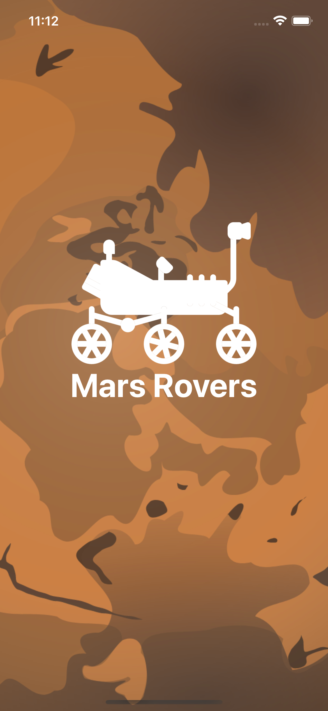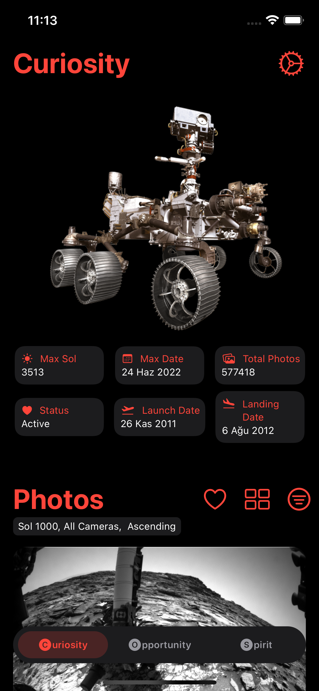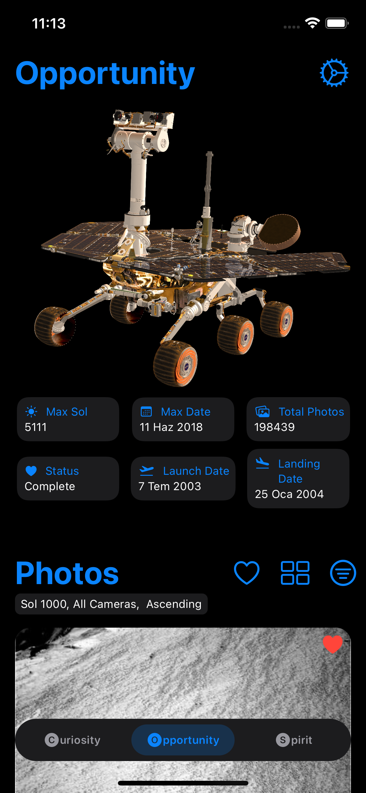 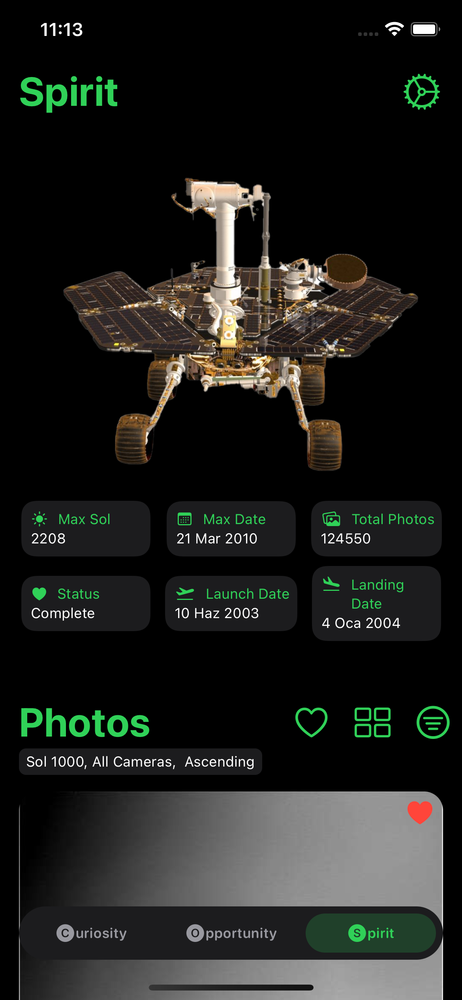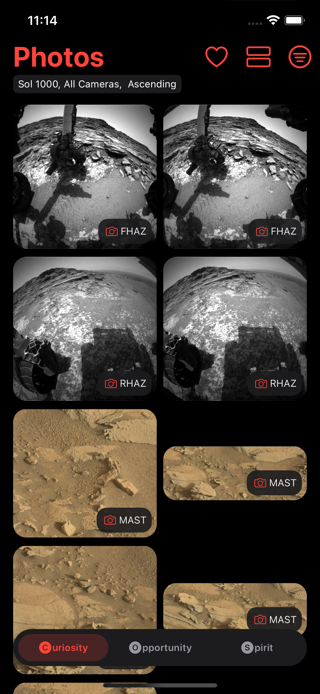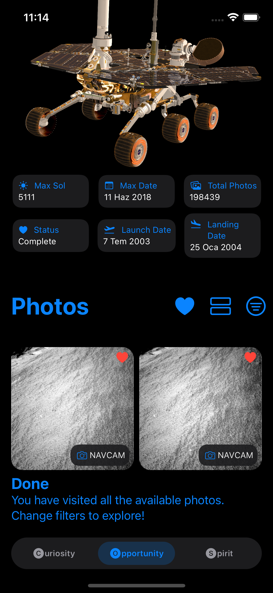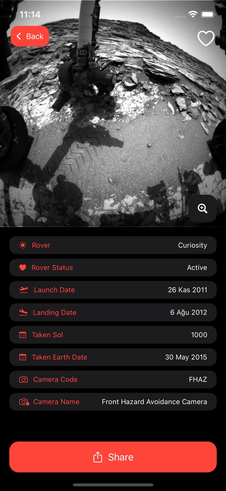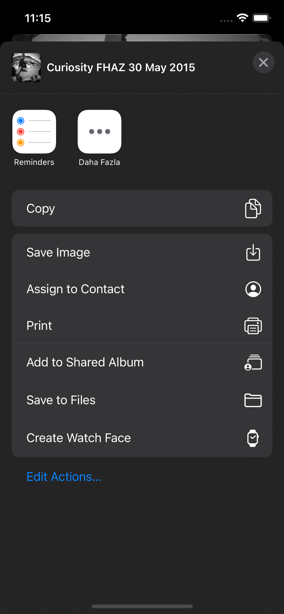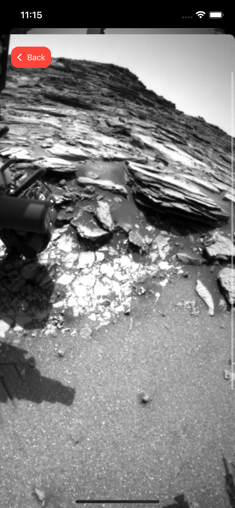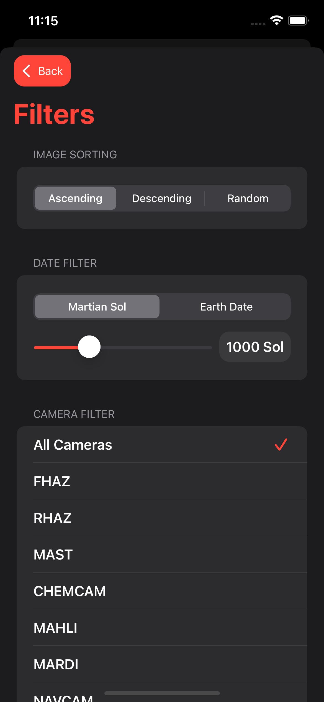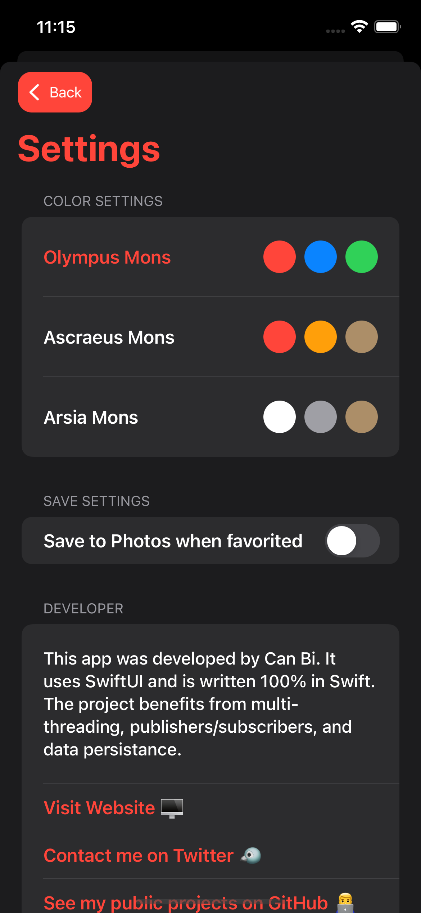 
### Light UI Screenshots
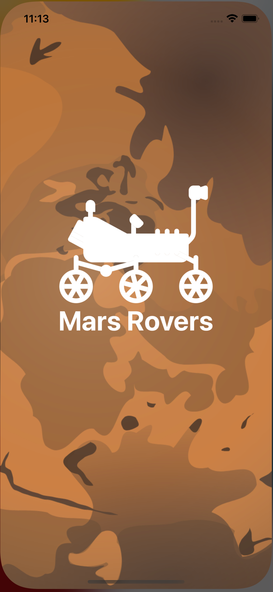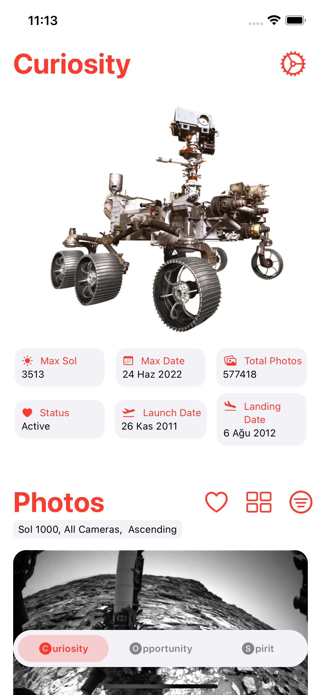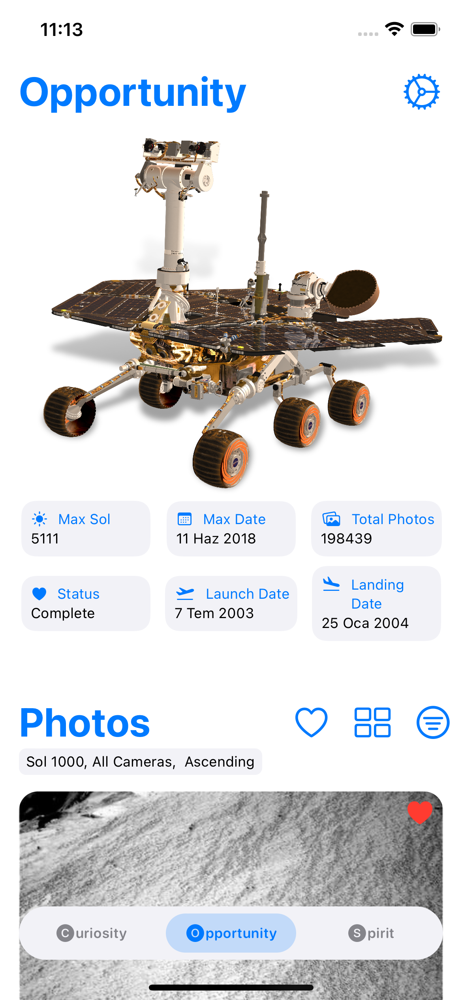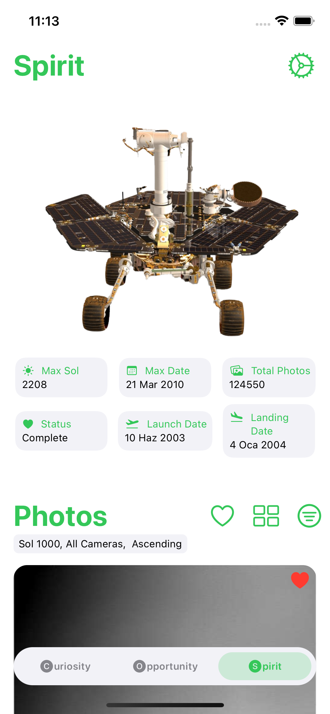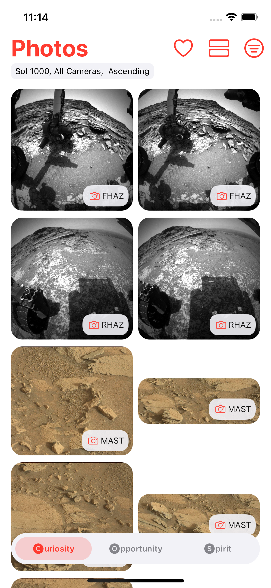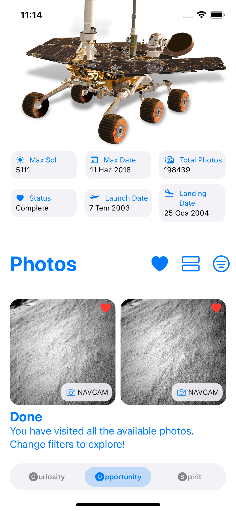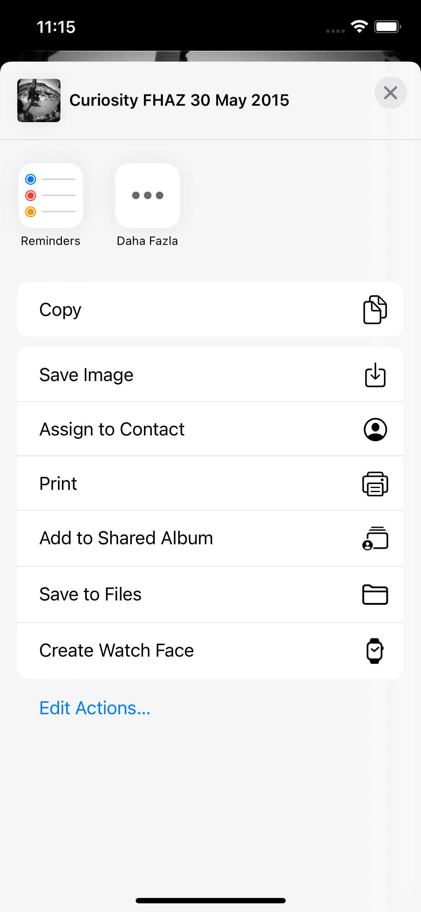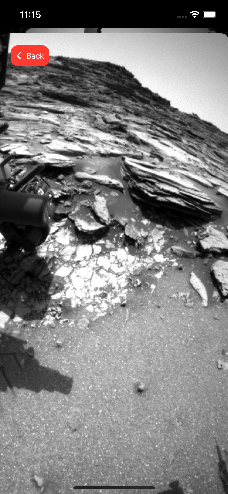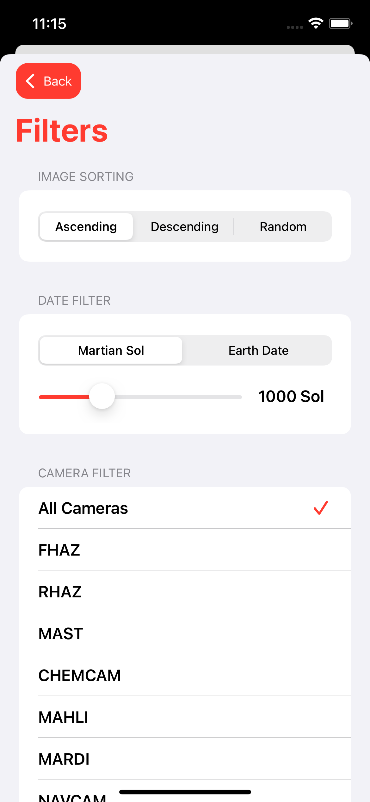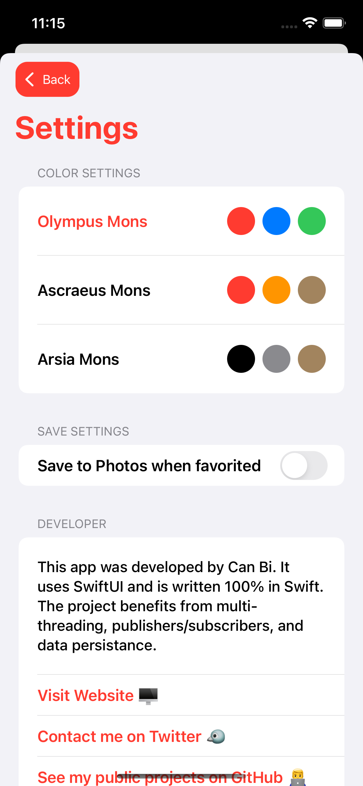
